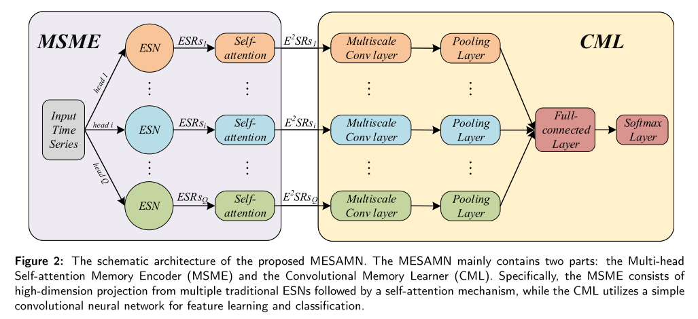

# Multiscale Echo Self-Attention Memory Network for Multivariate Time Series Classification
This is the training code for our work "Multiscale Echo Self-Attention Memory Network for Multivariate Time Series Classification"

## Abstract
Recently, ESN has been applied to time series classification own to its high-dimensional random
projection ability and training efficiency characteristic. The major drawback of applying ESN to time
series classification is that ESN cannot capture long-term dependency information well. Therefore,
the Multiscale Echo Self-Attention Memory Network (MESAMN) is proposed to address this issue.
Specifically, the MESAMN consists of a memory encoder and a memory learner. In the memory
encoder, multiple differently initialized ESNs are utilized for high-dimensional projection which is
thenfollowedbyaself-attentionmechanismtocapturethelong-termdependentfeatures. Amultiscale
convolutional neural network is developed as the memory learner to learn local features using features
extracted by the memory encoder. Experimental results show that the proposed MESAMN yields
better performance on 18 multivariate time series classification tasks as well as three 3D skeleton-
based action recognition tasks compared to existing models. Furthermore, the capacity for capturing
long-term dependencies of the MESAMN is verified empirically.

<div align="center">

</div>

## Data
We evaluate our model on publicly available time-series classification datasets from the UCR repositories:\
* [The UCR time series archive](https://ieeexplore.ieee.org/abstract/document/8894743)

3D skeleton-based action recognition datasets:
* [UTD-MHAD](https://personal.utdallas.edu/~kehtar/UTD-MHAD.html)
* [HDM05](https://resources.mpi-inf.mpg.de/HDM05/)
* [Florence3D](https://www.micc.unifi.it/resources/datasets/florence-3d-actions-dataset/)

## Requirements
The packages our code depends on are in ```./requirements.txt```.

## Usage
To train MESAMN, run
```bash
nohup python ./ESAMN_TS.py --cuda_device 0 --outfile ESAMN_MTS.csv >ESAMN.out 2>&1 &
```
```bash
nohup python ./UTD.py >ESAMN_UTD.out 2>&1 &
```
```bash
nohup python ./HDM05.py >ESAMN_HDM05.out 2>&1 &
```
```bash
nohup python ./F3D_baseline.py >ESAMN_F3D.out 2>&1 &
```
